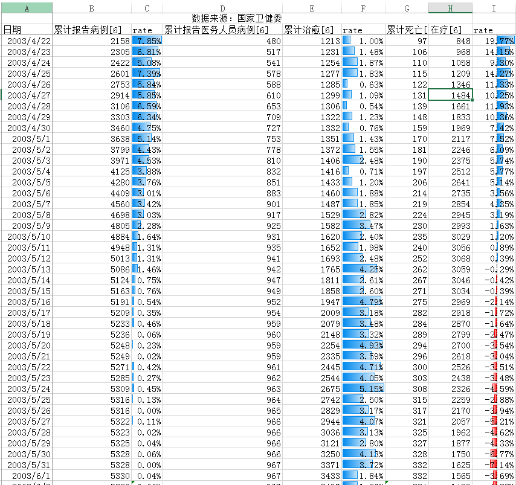

# 以史为鉴 武汉加油！

若有纰漏，欢迎指正。版权所有，翻版必究。

## 前言（Preface）

自21日开始持续关注疫情以来，比较关心疫情的发展，以此指导自身需要提前做好哪些预防性工作。

## 疫情数据简析（First Glance of Infant Numbers）

截止到1-21 0:00，大概情况是这样的：

<table align=center>
<tr>
<td colspan="6" align=center>
 武汉地区[1-2] (Wuhan Dist.)
 </td>
</tr>
<tr><td>重症病例</td><td> 危重症病例</td><td> 治疗中病例</td><td>已出院病例</td><td> 死亡病例 </td><td> 累计病例 </td></tr>
<tr><td> 51</td><td> 12</td><td>  227 </td><td>  25 </td><td>  6 </td><td>  258 </td></tr>
</table>
 
<table align=center>
<tr>
<td colspan="6" align=center>
湖北地区[1-2] (Hubei Dist.)
</td>
</tr>
<tr><td>重症病例</td><td> 危重症病例</td><td> 治疗中病例</td><td>已出院病例</td><td> 死亡病例 </td><td> 累计病例 </td></tr>
<tr><td>  51 </td><td> 12 </td><td> 239 </td><td> 25 </td><td> 6 </td><td> 270  </td></tr>
</table>

如下为SARS疫情初期情况：

该病最早于2002年11月16日在中国广东省顺德市出现，第一例报告病例（世界首例）的患者是于2002年12月15日在河源市发现患病的黄杏初[3]。2月6日非典型肺炎进入发病高峰，全省发现病例218例，当天增加45例，远超过此前单日新增病例[3]。

此次武汉新型肺炎最早出现于8 December 2019[4]，而在2020年1月21日，湖北地区即达到了270例[1-2]。

根据上述资料，疫情的传播速度可能比SARS更大。

## 疫情阶段分析（The Analysis of Phases）

1月26日，曾有记者在新闻发布会提问当前疫情处于什么阶段[5]。这个问题，本人也一直在关注，寻求一种&quot;疫情发展自信&quot;。

### SARS疫情阶段分析（Phase of SARS in China）

#### 病例数据

先放一张图：

 

图中的曲线根据国家卫健委网站的全国疫情播报数据[6-7]绘制而成。

再放一张微观点的图：

 

表中可以明显看出，2003.4.30左右累计确诊病例数增速显著下降了；2003.5.13左右，全国在疗人数达到了拐点，说明疫情传播和治愈达到了 **平衡** 。2003.5.22左右，全国 **治疗增速** 达到巅峰。

总结而言，疫情往乐观方向发展时，会出现：1、累计确诊数增速开始下降至0；2、确诊与治疗的平衡点；3、医疗资源/治疗能力充足。

#### 疫情发展影响因素[8]

疫情的发展其实受到很多因素影响：

1. 1、人口流动；
2. 2、气候因素；
3. 3、预防能力、措施；
4. 4、防范意识；

个人觉得，病毒的传播，本身可能本身存在一些瓶颈。

#### 政策雨[3]（Policies boom）

人类能起到非常关键作用的就是政策雨：

原定于5月1日开始的五一&quot;黄金周&quot;暂停施行一次，确保疫情不会进一步扩散。北京多所高校已经宣布停课。

4月23日，北京市宣布全市的中小学从24日起停课两周，确保疫情不会在校园扩散。

4月24日，铁道部通知旅客开车前要求退票，可全额退款。

4月26日，铁道部要求运输防治非典药物用品必须24小时内到达目的地。4月26日，中国民政部与卫生部联合发出紧急通知，要求死于传染性非典型肺炎患者的遗体要及时就地火化，不得举行遗体告别仪式和利用遗体进行其他形式的丧葬活动。

4月30日小汤山医院启用，北京市SARS病人都进入此医院治疗。4月30日卫生部发出紧急通知，要求非典型肺炎防治场所严禁使用中央空调。

5月3日，&quot;钟南山谈非典防治&quot;科教片将向全国公开发行。该片由中共广东省委宣传部、省卫生厅、省教育厅联合摄制，系目前全球惟一的、最具权威性的有关普及非典防治知识的科教片。全片长度为30分钟（中英文版）。

### 武汉新冠肺炎疫情阶段分析（Phase of 2019-nCoV in China）

#### 病例数据

同样地，绘制了一张图：

图中的曲线根据国家卫健委网站的全国疫情播报数据[6，9]绘制而成。

通过丁香园摘录的数据显示[10]：

2020/1/22 23:02 累计确诊544；

2020/1/28 17:34 累计确诊4599。

计算得到的每日复合增长率为45%， **如果** 继续这个速度发展，在31日 **可能** 看到累计确诊人数达到1万人（依据现有数据回归预测，请勿过分解读）。

只能说，疫情到目前为止并不乐观，但也别恐慌，因为政策雨已经来了。

#### 政策雨[11-16]（Policies boom）

根据目前的官方新闻，潜伏期大约在10天左右[11]。可见现有政策大概十天能看到效果。

但也有相关资料显示潜伏期在平均7天[12]。

1月23日10时，离汉通道关闭[13]。

1月24日，武汉火神山医院开间，预计2月3日交付使用[17]。

1月26日，国务院通知延长假期至2月2日[14]。

1月25日凌晨1时25分，大年初一，来自上海市28家市级医院和5个区近30家医院的136名医护人员，乘坐东航包机MU5000航班平安降落在武汉天河机场[15]。

1月27日，铁路部门均不收取退票手续费[16]。

依据传染病防控三大原则：控制传染源、切断传播途径、保护易感人群，不难发现，1月23日关闭离汉通道的关键举措，在10天后的2月2日左右可能会使得疫情往更好的方向发展。

## 参考文献（Reference）

[1]. 湖北省卫健委：[http://wjw.hubei.gov.cn/fbjd/tzgg/](http://wjw.hubei.gov.cn/fbjd/tzgg/) .[OL]

[2]. 武汉卫健委公告：[http://wjw.wuhan.gov.cn/front/web/list2nd/no/710](http://wjw.wuhan.gov.cn/front/web/list2nd/no/710) .[OL]

[3]. https://zh.wikipedia.org/wiki/SARS事件.[OL]

[4]. [https://en.wikipedia.org/wiki/2019%E2%80%9320\_Wuhan\_coronavirus\_outbreak](https://en.wikipedia.org/wiki/2019%E2%80%9320_Wuhan_coronavirus_outbreak) .[OL]

[5]. 国新办发布会：疫情进入严峻复杂阶段，加强防控后流行程度将下降：

[http://www.stdaily.com/zhuanti/fyywbd/2020-01/27/content\_857783.shtml](http://www.stdaily.com/zhuanti/fyywbd/2020-01/27/content_857783.shtml) .[OL]

[6]. 中国国家卫健委：[http://www.nhc.gov.cn/wjw/index.shtml](http://www.nhc.gov.cn/wjw/index.shtml) .[OL]

[7]. 2003年4月21日非典型肺炎疫情通报：

[http://www.nhc.gov.cn/wjw/zcjd/201304/70229aeb597b40c7a5bda35342dc7979.shtml](http://www.nhc.gov.cn/wjw/zcjd/201304/70229aeb597b40c7a5bda35342dc7979.shtml) .[OL]

[8]. 吴明雄. 近年来流感暴发疫情流行特征及影响因素分析[J]. 临床医药文献电子杂志, 2015(26):5428-5428.

[9]. 疫情通报：[http://www.nhc.gov.cn/xcs/yqtb/list\_gzbd.shtml](http://www.nhc.gov.cn/xcs/yqtb/list_gzbd.shtml) .[OL]

[10]. 丁香园疫情播报：

[https://3g.dxy.cn/newh5/view/pneumonia?from=timeline&amp;isappinstalled=0](https://3g.dxy.cn/newh5/view/pneumonia?from=timeline&amp;isappinstalled=0) .[OL]

[11]. 国家卫健委：病毒潜伏期10天左右 最短1天最长14天：

[http://cnews.chinadaily.com.cn/a/202001/26/WS5e2d7e07a3107bb6b579ba50.html](http://cnews.chinadaily.com.cn/a/202001/26/WS5e2d7e07a3107bb6b579ba50.html) .[OL]

[12]. 白岩松连线专家：新型冠状病毒肺炎潜伏期平均7天 目前没有对症药物，

[https://baijiahao.baidu.com/s?id=1656393186227293814](https://baijiahao.baidu.com/s?id=1656393186227293814) .[OL]

[13]. [https://weibo.com/2656274875/IqMDEmtqV](https://weibo.com/2656274875/IqMDEmtqV?type=comment#_rnd1580216942217) . [OL]

[14]. [http://www.gov.cn/xinwen/2020-01/27/content\_5472383.htm](http://www.gov.cn/xinwen/2020-01/27/content_5472383.htm) . [OL]

[15]. [https://baijiahao.baidu.com/s?id=1656672098744161488](https://baijiahao.baidu.com/s?id=1656672098744161488) . [OL]

[16]. [https://www.12306.cn/mormhweb/zxdt/202001/t20200127\_28094.html](https://www.12306.cn/mormhweb/zxdt/202001/t20200127_28094.html) . [OL]

[17]. [https://baike.baidu.com/item/武汉蔡甸火神山医院](https://baike.baidu.com/item/%E6%AD%A6%E6%B1%89%E8%94%A1%E7%94%B8%E7%81%AB%E7%A5%9E%E5%B1%B1%E5%8C%BB%E9%99%A2) . [OL]